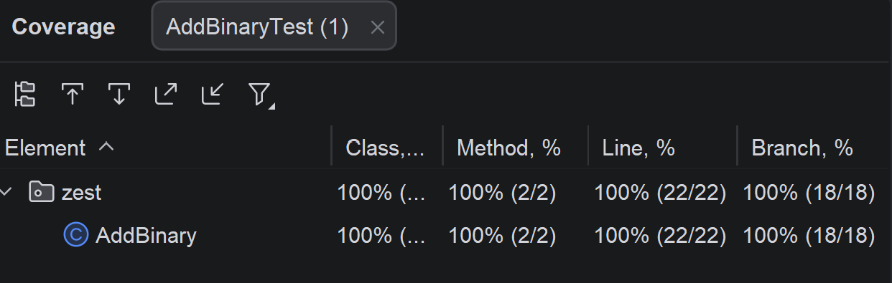

# Solution for the Add Binary exercise

## 1. Specification-based testing
### 1. Understand the requirement, inputs, and outputs
The program takes two strings as input. These strings represent binary numbers. The method should return their sum as a 
binary string. Valid inputs may only contain 0 and 1, must not be null, must have length between 1 and 10000, and may not
contain leading zeros unless the number is exactly "0". Invalid inputs should cause an IllegalArgumentException.
According to the specification pre-conditions were added to make sure that the method operates on valid 
inputs.

### 2. Explore the program
After making sure that the passed input strings are not null, we are using a Regular Expression to validate the input strings
against the defined format. After that, the program performs binary addition from right to left, 
storing the result bit by bit and propagating carry values until both strings are fully processed. 
If a carry remains at the end, it is added to the front of the result.

### 3. Judiciously explore the possible inputs and outputs, and identify the partitions.
Inputs: two binary strings, either valid or invalid. 
The relevant partitions are: null inputs, empty strings, strings with leading zeros, 
strings above maximum length, valid strings of equal length, valid strings of unequal length, 
additions with carry, additions without carry, and cases involving "0".

### 4. Identify the boundaries
Length of input strings: min 1, max 10000.
Valid special case: "0".
Invalid boundary cases: empty string, strings starting with 0 such as "0011", and strings of length 10001.
Arithmetic boundaries: no carry, carry in the middle, and final carry producing an additional bit.

### 5. Devise test cases based on the partitions and boundaries
Null input, empty strings, strings with leading zeros, strings larger than allowed, valid strings on the upper bound, 
"0" + "0", one-digit inputs, equal and unequal length inputs, addition with carry, addition without carry, 
and addition where the final carry creates a new leading bit.

### 6. Automate the test cases
Done based on the previous findings  

### 7. Augment the test suite with creativity and experience
To avoid cluttering the method with input validation I added a regex to make
sure that the provided inputs are valid.

## 2. Structural Testing

## 3. Mutation Testing
During the mutation tests the following problem appeared: 
- When i or j are negative the while condition loops infinitely, however after closer inspection, 
it is clear that this situation can't occur (thanks to the input validation) and is just
occurring because of the mutation test creating a pathological code path