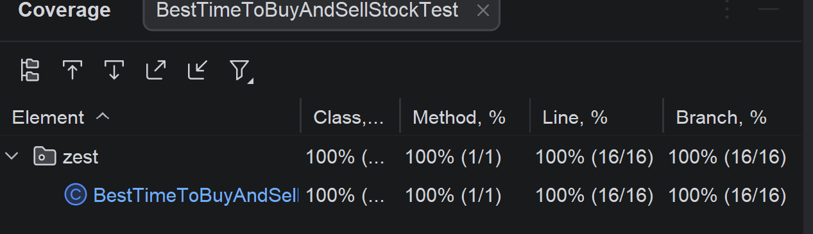

# Solution for the Best time to buy and sell stock exercise

## 1. Specification-based testing
### 1. Understand the requirement, inputs, and outputs
The program takes an array of integers as an input. The integers represent the price of some arbitrary stock 
over a period of time which is given by the length of the array, and each timestep representing
one day. The stock values cannot be negative or larger than 10^4. The program should calculate 
the highest possible profit, by buying it at day x and selling it at day x + y. It's important
to note that the program should not get stuck in local maxima. 

### 2. Explore the program
The program didn't contain checks for the constraints mentioned in the 
README, so those were added.

### 3. Judiciously explore the possible inputs and outputs, and identify the partitions.
Inputs: array containing values between 0 and 10^4

### 4. Identify the boundaries
Length of input array: min 1, max 10^5
Entries of input array: integer, min 0, max 10^4

### 5. Devise test cases based on the partitions and boundaries
Null, Empty array, Array with 1 element, Array larger than allowed
negative entries, values too big, ascending values array, descending values array, 
test with two maxima

### 6. Automate the test cases
Done based on the previous findings

### 7. Augment the test suite with creativity and experience
To avoid cluttering the method with input validation I added a regex to make
sure that the provided inputs are valid.

## 2. Structural Testing

## 3. Mutation Testing
During the mutation testing a problem appeared:
- The initial test cases didn't distinguish between > and >= because the tests
were performed with MAX_LENGTH + 1. So I adjust the tests accordingly to also cover that
boundary value.