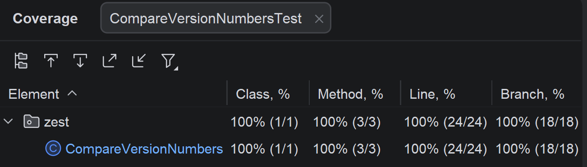

# Solution for the Compare version numbers exercise

The documentation of the decisions and steps taken for testing the Compare Version Numbers solution.

## 1. Specification-based testing
### 1. Understand the requirement, inputs, and outputs
The program takes two version strings as input and returns an integer describing their order.
It should compare the revisions of both versions from left to right. Each revision is interpreted as an integer, 
so leading zeros do not matter. If one version has fewer revisions, the missing parts should be treated as 0.
The result should be -1 if version1 is smaller, 1 if version1 is greater, and 0 if both are equal.

### 2. Explore the program
The program first checks whether one of the inputs is null and whether both strings match the required version format.
It then splits both version strings at the dots and compares their parts. Each part is parsed as an integer, 
which also checks whether it still fits into a 32-bit signed integer. The method didn't contain checks for the constraints mentioned in the
README, so those were added.

### 3. Judiciously explore the possible inputs and outputs, and identify the partitions.
Inputs: two version strings, either valid or invalid. Relevant partitions are: null inputs, empty strings, 
invalid characters, versions with too many revisions, revisions that are too large for int, equal versions, 
versions with leading zeros, versions of different length, and versions that differ at some revision.

### 4. Identify the boundaries
Length of input strings: min 1.
Number of revision blocks: max 501.
Revision value: must fit into a 32-bit signed integer.
Important boundaries are null vs non-null, empty string vs valid string, valid format vs invalid format,
maximum allowed number of revisions vs too many revisions, and largest valid integer vs too large integer.

### 5. Devise test cases based on the partitions and boundaries
Null input, empty string, invalid version format, version with too many revisions, revision value too large,
equal versions, version1 greater than version2, versions of different length, and versions with leading zeros.

### 6. Automate the test cases
Done based on the previous findings. During execution of the test cases it became clear
that the version number comparison returned the wrong value. It returned -1 if version1
is bigger than version2, instead of 1. So that was fixed to match the specification. 

### 7. Augment the test suite with creativity and experience
To avoid cluttering the method with input validation I added a regex to make
sure that the provided inputs are valid.

## 2. Structural Testing

## 3. Mutation Testing
No new insights from mutation testing.