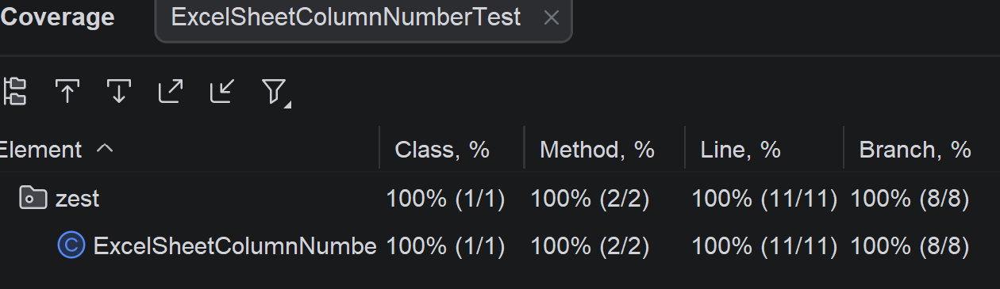

# Solution for the Excel Sheet Column Number exercise

## 1. Specification-based testing
### 1. Understand the requirement, inputs, and outputs
The program takes one string as input and returns the corresponding Excel column number as an integer. 
The input must be a non-empty string containing only uppercase letters from A to Z. 
Invalid inputs should cause an IllegalArgumentException.

### 2. Explore the program
The program first checks whether the input is null or empty, and then validates that it only contains uppercase letters. 
After that, it processes the string from left to right and computes the result like a base-26 number,
where A corresponds to 1 and Z to 26. The method didn't contain checks for the constraints mentioned in the
README, so those were added.

### 3. Judiciously explore the possible inputs and outputs, and identify the partitions.
Inputs: one string, either valid or invalid. Relevant partitions are null input, 
empty string, invalid characters, single-letter titles, and multi-letter titles.

### 4. Identify the boundaries
Length of input string: min 1.
Valid characters: A to Z.
Important boundaries are null vs non-null, empty vs non-empty, valid uppercase letters vs invalid characters, 
and small valid titles such as A and larger valid titles such as ZZZ.

### 5. Devise test cases based on the partitions and boundaries
Null input, empty string, invalid titles containing digits or lowercase letters, single-letter titles 
such as A, multi-letter titles such as AB and ZY, and larger valid titles such as ZZZ.

## 6. Mutation Testing
No new insights from mutation testing.

## 7. Coverage Result
