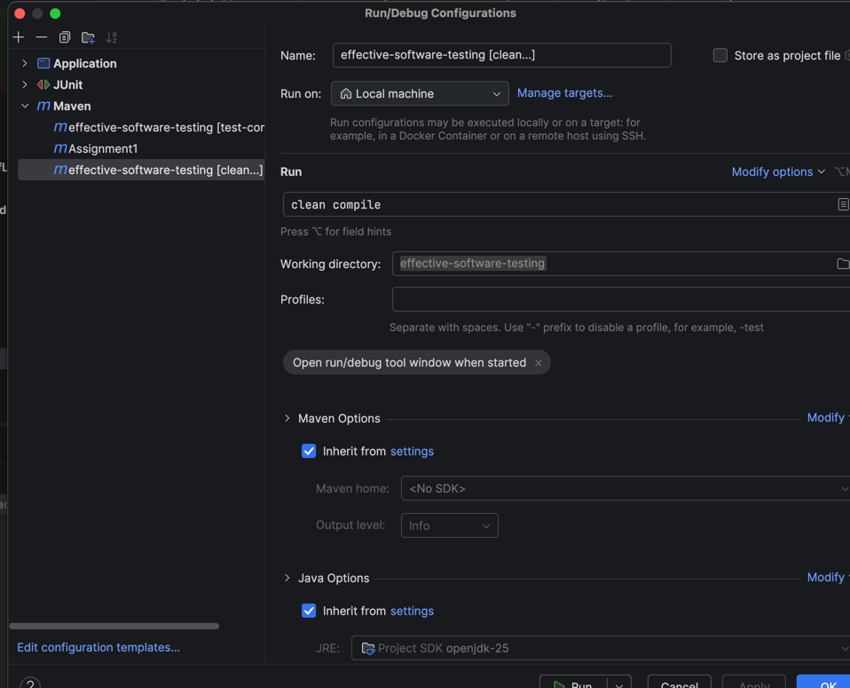
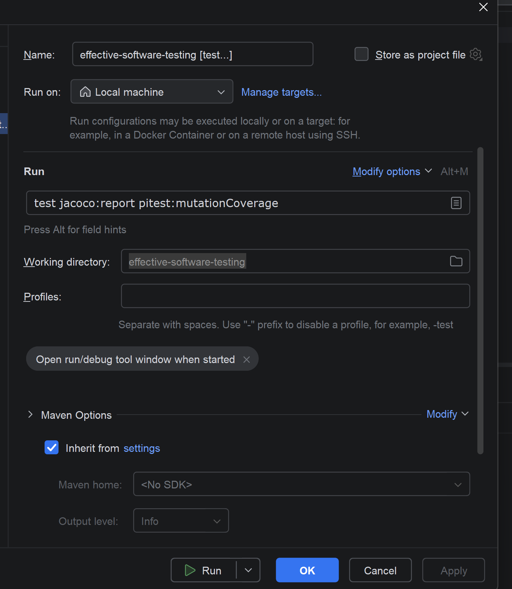

Parent module is effective-software-testing and per assignment there is one child-module.
Each child-module then has child modules for the different exercises. 

To initially setup the maven project run targets clean and compile from the root directory:

When trying to run the tests for the whole module, execute this command from the root directory (effective-software-testing):
test jacoco:report pitest:mutationCoverage

When trying to run a specific assignment or a specific exercise, execute the command within the given
directory. 

To run a specific module add the -pl flag together with the module to build, e.g.:
test jacoco:report pitest:mutationCoverage -pl AddBinary

